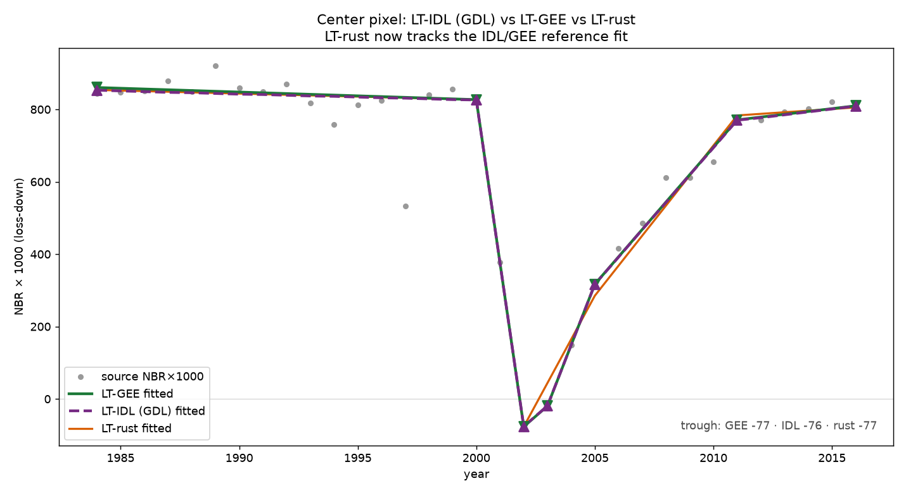
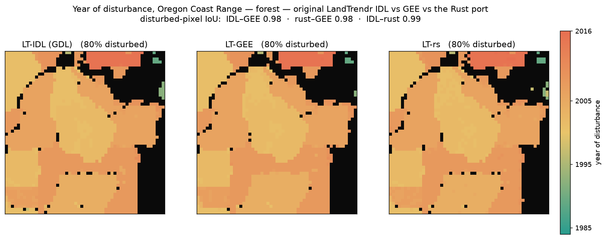
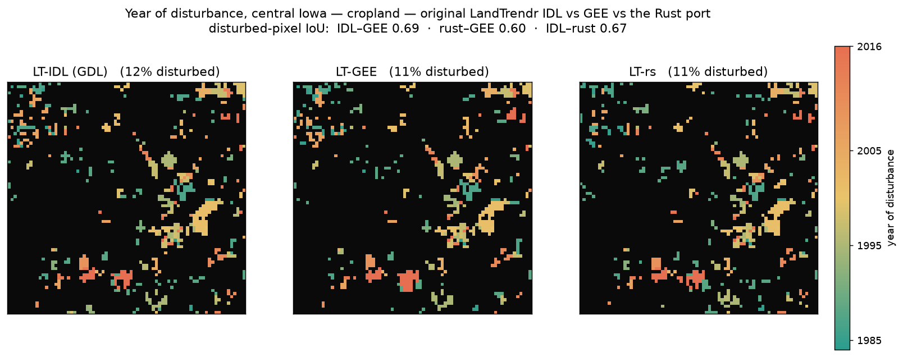

# LT-rs

Rust **LandTrendr** (Kennedy 2010/2018), validated against the original LandTrendr-IDL
and Google Earth Engine. A pixel's annual NBR trajectory in, the fitted trajectory and
disturbance/recovery breakpoints out. One kernel for local, Python (PyO3), and browser (WASM).

## Install

Prebuilt wheels (CPython ≥3.10, incl. 3.14) are attached to each
[release](../../releases) — no Rust toolchain needed:

```bash
pip install landtrendr --find-links https://github.com/nthh/LT-rs/releases/expanded_assets/v0.3.0
```

## Use

```python
import numpy as np, landtrendr as lt

box   = np.load("data/nbr_1984_2016.npz")        # bundled Landsat NBR box (Oregon Coast Range)
nbr   = np.ascontiguousarray(box["annual"][:, 26, 26], np.float32)   # center pixel; NaN = cloud gap
years = box["years"]                             # 1984..2016

fitted, is_vertex, rmse = lt.pixel(nbr, years)   # LT-GEE default runParams
breakpoints = years[is_vertex.astype(bool)]      # [1984, 1985, 2000, 2001, 2002, 2008, 2016]
```

That pixel is a conifer stand clearcut around 2001 — the fit bottoms out at 2002, then
recovers through 2016. (Installed via `pip` without the repo? Pass your own per-year NBR
array — loss-down `float32`, `NaN` for cloud gaps — in place of the bundled box.)

Every LandTrendr runParam maps to a snake_case keyword with the LT-GEE default
(`max_segments=6`, `spike_threshold=0.9`, `recovery_threshold=0.25`,
`p_value_threshold=0.05`, `best_model_proportion=0.75`, `min_observations_needed=6`,
`vertex_count_overshoot=3`, `prevent_one_year_recovery=True`). For a whole raster
stack, `lt.flat(stack, years)` takes a `(n_pixels, n_years)` array and returns
`(n_pixels, 4)` summary bands `[net_mag, year, rmse, peak_to_trough]`.

Two raster functions feed the eMapR forest-loss ensemble:
`lt.ftvdiff_flat(stack, years, target_year)` is the per-year FTV-diff loss signal
(eMapR `getLtFtvDiff`), and `lt.loss_window(stack, years, target_year, half_window)`
sums loss over a window for higher recall when a disturbance is fit as a multi-year
ramp. All four take the same runParam keywords.

## Validated against GEE and the original LT-IDL

GEE is itself a translation of the original IDL LandTrendr, so we validate against both.
Fed the same NBR series, the Rust fit tracks Earth Engine's LandTrendr *and* the source
IDL, landing the disturbance vertex on the same year — here the LT-GEE Fig 2.1 example
pixel (mature conifer, clearcut 2001, regrowth to 2016):



`python/idl_compare.py` runs the unmodified LandTrendr-2012 IDL (`fit_trajectory_v2` →
`tbcd_v2`) under [GNU Data Language](https://github.com/gnudatalanguage/gdl); on the 5
GEE-truth pixels **LT-IDL and LT-GEE agree on every vertex (5/5), fitted MAE 2.1 NBR×1000**
— confirming GEE faithfully tracks IDL, and giving the white-box reference the port was
debugged against, stage by stage.

### Raster scale, across land covers

Running all three on the **same** GEE composites over small AOIs and comparing the
per-pixel year of greatest disturbance (disturbed-pixel IoU + overall agreement):

| site | land cover | IoU rust–GEE | IoU IDL–GEE | IoU IDL–rust | overall |
|---|---|---|---|---|---|
| Oregon Coast Range | forest | 0.98 | 0.98 | 0.99 | 0.98 |
| central Iowa | cropland | 0.61 | 0.69 | 0.67 | 0.95 |
| northern Nevada | arid / shrub | — (no events) | — | — | 1.00 |




Forest matches closely on all three. On cropland even IDL and GEE only agree at 0.69 —
annual harvest cycles are marginal signals for LandTrendr — and LT-rs tracks IDL to
0.67, near that intrinsic ceiling; arid has no disturbance to find, so all three agree.
The 3-panel maps come from `python/idl_vs_gee_vs_rust_map.py` (needs GDL; see `idl-harness/`).

```bash
pip install -r python/requirements.txt
python python/compare.py                  # single pixel: bundled NBR box + GEE truth
python python/compare_maps.py             # raster: Rust vs GEE on the bundled composites
python python/idl_vs_gee_vs_rust_map.py   # raster: LT-IDL vs LT-GEE vs LT-rs (needs GDL)
# the bundled data regenerates with python/fetch_nbr.py and gee_dist_map.py (cloud COGs / EE account)
```

## Optional: GDAL-free data access

`fetch_nbr.py` reads Landsat via rasterio. `fetch_nbr_lazycogs.py` does the same with
**no GDAL** (rustac + lazycogs + obstore), producing byte-identical composites — needs
Python 3.13 (lazycogs segfaults on 3.14).

## Build from source

Needs the Rust toolchain ([`rustup`](https://rustup.rs)) and `maturin`. The `python`
feature enables the PyO3 bindings; abi3 builds a single wheel per platform.

```bash
pip install maturin
maturin develop --features python     # compile + install into the active venv
python python/compare.py              # validate against the bundled GEE reference

# or build a wheel without installing:
maturin build --release --features python --out dist
```

## Faithfulness to the original algorithm

This kernel is a faithful port of the original LandTrendr-IDL algorithm, validated
stage by stage against the real IDL run under GNU Data Language (see *Validated
against the original LT-IDL* above). The pieces that matter are ported, not
approximated:

- **Fitting:** sequential anchored point-to-point regression (`find_best_trace` +
  `anchored_regression`) — the IDL primary fit, not a simultaneous solve.
- **Vertex culling:** the `angle_diff` importance metric with its disturbance
  weighting, so disturbance and recovery vertices are protected from removal.
- **Model selection:** `pick_best_model6` over a per-model F-test vs a flat line
  (exact incomplete-beta F CDF) with the collapse-to-flat rule for non-significant
  fits; the candidate ladder uses `take_out_weakest2` (recovery-violator first, else
  least local MSE, with the in-place point interpolation).
- **Despiking:** the iterative `desawtooth`.

The remaining differences are at the floating-point floor — this is not a bit-exact
port (f32 vs IDL's f64, accumulation order) — surfacing only as a few marginal pixels
in noise-only scenes, not as an algorithmic gap.

## References

- Kennedy, R.E., Yang, Z., Cohen, W.B. (2010). Detecting trends in forest disturbance
  and recovery using yearly Landsat time series: 1. LandTrendr — Temporal Segmentation
  Algorithms. *Remote Sensing of Environment* 114(12), 2897–2910.
  [doi:10.1016/j.rse.2010.07.008](https://doi.org/10.1016/j.rse.2010.07.008)
- Kennedy, R.E. et al. (2018). Implementation of the LandTrendr Algorithm on Google
  Earth Engine. *Remote Sensing* 10(5), 691.
  [doi:10.3390/rs10050691](https://doi.org/10.3390/rs10050691)

## License

MIT
